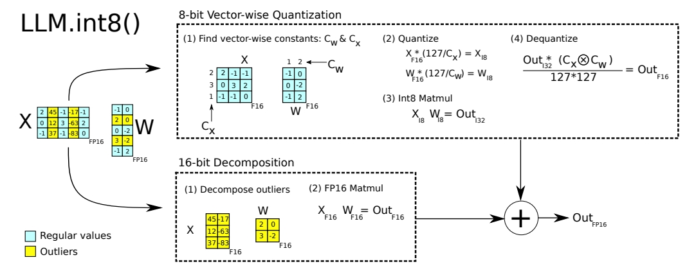

## Int8-量化

​	[文章](https://arxiv.org/abs/2208.07339)提出了一种基于$Int8$矩阵乘法的优化方法，应用于transformer架构中的特定层。这种方法能够显著减少推理时所需的内存（减半），同时不影响模型性能。该方法适用于非常大的模型，如包含1750亿参数的模型，这些模型可以被加载、转换为更节省空间的格式，并直接用于推理，而不引起性能损失。为了有效处理变压器模型中复杂的特征分布，团队设计了一个名为LLM.int8()的两阶段量化流程。第一阶段采用向量级别的量化，第二阶段则针对特殊异常值采用了混合精度分解方案，确保绝大多数计算仍能在8位精度下完成，而只有极少数情况需要用到16位精度。

###   （1）向量级别的量化	

​	文章指出，在使用单一缩放因子对整个张量进行量化时，单个异常值可能会显著影响其他数值的量化精度。为了解决这个问题，文章引入了多个缩放因子，例如块级缩放因子，以限制异常值对全局量化精度的影响，将其效应约束在局部范围内。在此基础上，文章改进了传统的按行量化方法，采用更为精细的向量级量化技术。通过这种方法，能够更有效地处理异常值，同时保持整体量化精度（$Q$表示量化方法，例如[Absmax](./3-量化基础.md)或[Zeropoint](./3-量化基础.md)量化方法）：
$$
\mathbf{C}_{f_{16}} \approx \frac{1}{\mathbf{c}_{x_{f_{16}}} \otimes \mathbf{c}_{w_{f_{16}}}} \mathbf{C}_{i_{32}} = S \cdot \mathbf{C}_{i_{32}} = S \cdot \mathbf{A}_{i_{8}} \mathbf{B}_{i_{8}} = S \cdot Q(\mathbf{A}_{f_{16}}) Q(\mathbf{B}_{f_{16}})
$$
  如图中上半部分所示：

  给定向量隐层向量 $X$  和模型权重 $W$ 的参数：
$$
X_{f_{16}} = 
\begin{pmatrix}
2 & -1 & -1 \\
0 & 3 & 2 \\
-1 & -1 & 0
\end{pmatrix}
$$

$$
W_{f_{16}} = 
\begin{pmatrix}
-1 & 0 \\
0 & -2 \\
-1 & 2
\end{pmatrix}
$$

​	缩放常数为：
$$
C_X \otimes C_W = 
\begin{pmatrix}
2 \\
3 \\
1
\end{pmatrix}
\otimes
\begin{pmatrix}
1 & 2
\end{pmatrix}
=
\begin{pmatrix}
2 & 4 \\
3 & 6 \\
1 & 2
\end{pmatrix}
$$
​	量化的最终结果为：
$$
\text{Out}_{i32} = \frac{X_{f16} * W_{f16}}{C_X \otimes C_W} * 127 * 127
$$

$$
= 
\begin{pmatrix}
-0.5 & 3.0 \\
-1.0 & 0.33 \\
1.0 & -2.0
\end{pmatrix}
\approx
\begin{pmatrix}
-1 & 3 \\
-1 & 0 \\
1 & -2
\end{pmatrix}
$$

### （2）混合精度分解

​	然而，对于大规模模型（如包含超过67亿参数的变压器模型），即便是向量级量化也难以有效处理出现的大数值异常特征。为此，我们引入了混合精度分解技术。通过该技术，极少数大数值特征得以用更高的精度（16位）表示，而其余大多数值仍以较低的精度（8位）处理。这不仅确保了大部分数据的高效存储与快速计算，同时也保障了关键特征的高精度表示，从而在优化模型性能的同时大幅减少了内存占用，实现了性能与资源利用的最佳平衡：
$$
C_{f16} \approx \sum_{h \in O} \mathbf{x}_{f16}^h \mathbf{w}_{f16}^h + \mathbf{s}_{f16} \cdot \sum_{h \in O} \mathbf{x}_{i8}^h \mathbf{w}_{i8}^h
$$
​	计算方式如下：

**总结**

  文章首次证明了数十亿参数的Transformer模型可以通过量化至Int8用于推理，而不损失性能。通过分析大规模异常特征，文章开发了混合精度分解方法，将这些异常值隔离到单独的16位矩阵乘法中。结合向量级量化技术，LLM.int8()方法实验证明能够恢复高达175B参数模型的完整推理性能。

  然而，本文研究存在几个局限性：

- 分析仅限于Int8数据类型，未涉及8位浮点（FP8）数据类型，因为当前GPU和TPU尚不支持FP8。
- 文章没有对注意力函数应用Int8乘法，鉴于注意力机制不涉及参数且重点是减少内存占用，这并非严格必要。初步探索显示，解决此问题可能需要额外的量化方法。
- 研究主要关注推理阶段，而未涉及训练或微调过程。

​	通过上述改进和局限性的明确，文章展示了在大规模Transformer模型量化方面的重要进展，并为未来的研究指明了方向。